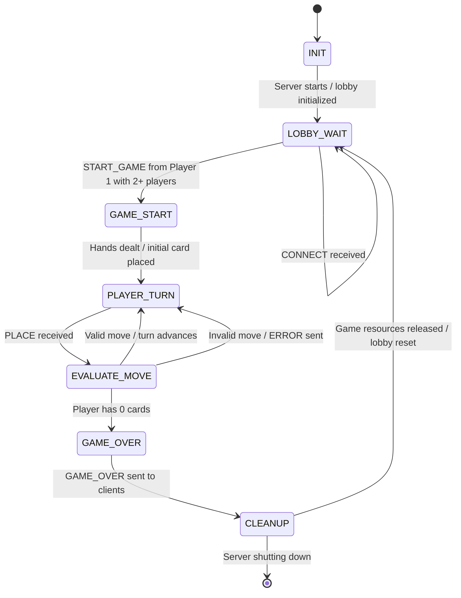

The following diagram describes the server-side game state machine:

```mermaid
stateDiagram-v2
    [*] --> INIT

    INIT --> LOBBY_WAIT: Server starts / lobby initialized

    LOBBY_WAIT --> LOBBY_WAIT: CONNECT received
    LOBBY_WAIT --> GAME_START: START_GAME from Player 1 with 2+ players

    GAME_START --> PLAYER_TURN: Hands dealt / initial card placed

    PLAYER_TURN --> EVALUATE_MOVE: PLACE received

    EVALUATE_MOVE --> PLAYER_TURN: Valid move / turn advances
    EVALUATE_MOVE --> PLAYER_TURN: Invalid move / ERROR sent
    EVALUATE_MOVE --> GAME_OVER: Player has 0 cards

    GAME_OVER --> CLEANUP: GAME_OVER sent to clients

    CLEANUP --> LOBBY_WAIT: Game resources released / lobby reset
    CLEANUP --> [*]: Server shutting down
```
